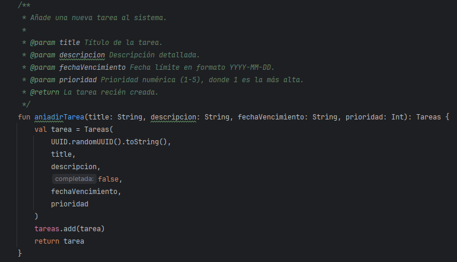
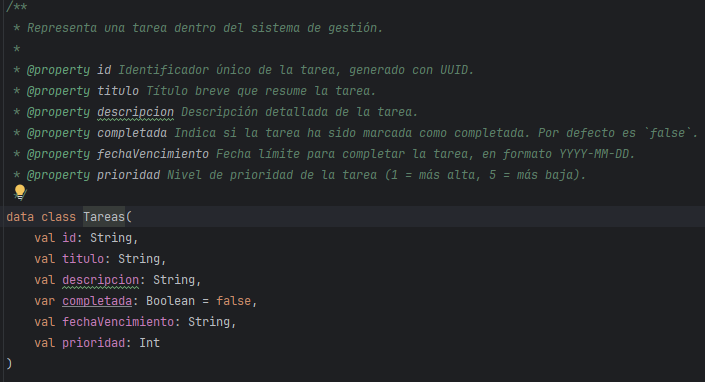
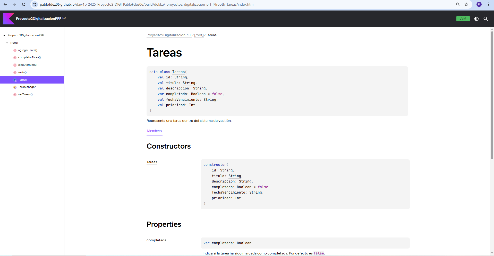

# Documentación de Clases con KDoc y Dokka en Kotlin

---

# INTRODUCCIÓN

Para este ejercicio, he utilizado un proyecto entregado con anterioridad en la asignatura de Digitalización, como introduccion, he de explicar que mi proyecto se basa en un TaskManager que tiene las funciones básicas de un CRUD. Mi programa se loguea en la app, inicia sesión y puedes crear tareas, modificarlas y eliminarlas ya sea individual o conjuntamente.

Para la documentación con el uso de KDOC como pide el ejercicio, hemos implementado las dependencias en el gradlew y sincronizado el mismo, seguidamente, hemos ido documentando el código con la sintaxis de KDOC, para posteriormente a traves de un comando, generar dicha documentación, la cual sale exportada en forma de página web, tanto html con css.

Para ello voy a mostrar un par de ejemplos de cual es dicha sintaxis aplicada en alguna funcion de nuestro código, y voy a dejar un enlace a la documentanción de mi proyecto donde esta algo más explicado, y podemos encontrar más información sobre el proyecto mismo.

---

## ENLACE A MI PROYECTO | DIGI

[DOCUMENTACIÓN SOBRE MI PROYECTO | DIGITALIZACIÓN](ProyectoDIGI.md)

## ENLACE A WEB GENERADA POR DOKKA

Como he explicado anteriormente, la virtud de esta tecnica de documentación es que te genera una web mostrando las clases o funciones generadas con sus propiedades, etc. por lo cual voy a adjuntar el enlace para que sea accesible directamente

[ENLACE A WEB DOKKA](build/dokka/index.html)

**EJEMPLO DE CAPTURA RESULTADO HTML**

---
